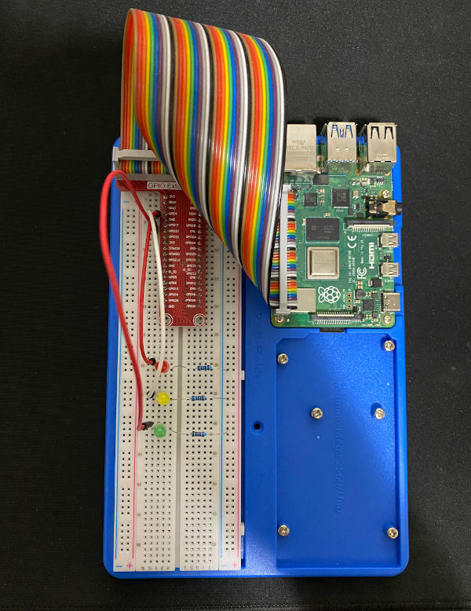

# Humble Pi

A collection of Raspberry Pi projects.

[](https://travis-ci.com/Justintime50/humble-pi)
[](https://coveralls.io/github/Justintime50/humble-pi?branch=master)
[](https://pypi.org/project/humble-pi)
[](LICENSE)

## Install

```bash
# Install tool
# TODO: Not yet available on PyPi

# Install locally
make install

# Get Makefile help
make help
```

## Usage

### Stoplight

Turn on red, yellow, and green LEDs like a stoplight, iterating multiple times. Uses pins `4 = red`, `17 = yellow`, and `27 = green`.

```bash
sudo python stoplight.py
```

**Hardware Example**



## Development

```bash
# Lint the project
make lint

# Run tests
make test
```
